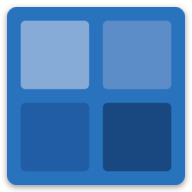
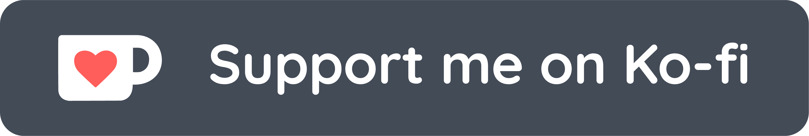
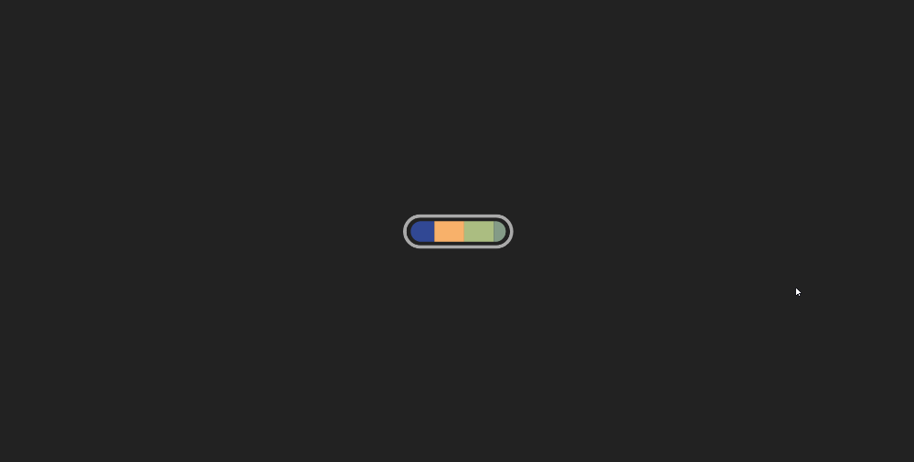

  
  <h1 align="center"><a href="https://www.shadegenerator.com" target="_blank">shade-generator</a></h1>

Generate shades... AND tints of your favorite colors

Shade Generator aims to provide a quick and easy way to generate the shades and tints of the colors you use in all of your web development and design projects.

It's very easy to use.  Just enter the color you would like to get shades for (accepts hex, css names, rgb, and more) and the site does the rest.  Hover over the shade you want the color code for (tap on mobile) and click on the format you would like to copy to your clipboard.  If you want some inspiration, check out the sidebar where you can see the most popularly used colors as well as a the most recent.  You can also view the list of named colors to get a broad range of color inspiration.

## The Story behind Shade Generator (a.k.a. the boring part)
Shade generator is a project that started as a codepen a couple years ago. The idea behind it was simple, when you overlap a color with a transparent white or black section, you end up with a tint or shade of that color. As many people do in web development, I would often use this trick to create a contrasting color effect for button hovers or element borders. This got annoying because in order to make the effect work, I would need two elements on the screen for the overlap where I often only needed one. So, I decided to make a little tool to help me find the color codes for this resulting shade by giving me a variety of overlapping icons with the color I was plannibg on using as the background. However it was still not the most convenient because I had to use a chrome plugin called ColorZilla to get the actual code of the resulting color, however I could not think of a better way. Finally, after using this tool hundreds of times I finally thought, there must be some way to calculate this resulting color!

After a quick google search, I found this link. I immediately realized calculating the colors I wanted was possible with this very simple formula...

*to be continued...*

### Features

Throughout the process of making this website, I slowly started adding in some cool additional features. Some served a purpose, some just for fun.

#### Color Parser

One of the first things I added was the NPM package parse-color. It takes a string and parses it for its color values in many different formats. It can parse colors from hex values, rgb values, css named colors, and cymk formats. The result is an object that has the following components:

* **rgb** - an array of [ red, green, blue ]
* **hsl** - an array of [ hue, saturation, luminosity ]
* **hsv** - an array of [ hue, saturation, value ]
* **cmyk** - an array of [ cyan, magenta, yellow, blac(k) ]
* **keyword** - the name of the color, if known
* **hex** - the hex rgb string #rrggbb
* **rgba** - rgb plus an alpha value
* **hsla** - hsl plus an alpha value
* **hsva** - hsv plus an alpha value
* **cmyka** - cmyk plus an alpha value

This was useful, not only to interpret input from the user but also for providing hex and rgb values, both of which are important to this app's functionality. After scrubbing the user input before passing it to this function, it does a great job of matching everything you'd expect it to!

#### Copy to Clipboard

The next main thing I added was the option to click to copy either the hex code or the rgb code to your clipboard. The first two things I tried were document.execCommand("copy") and navigator.clipboard.write(). Both of these options worked but I ran into issued with them working on all devices. I soon stumbled upon a nice small NPM package called clipboard-polyfill. It is nice and compact and gave me a convenient way to ensure copying would work on all devices and browser the clipboard is accessible in!

#### Color Names
Now that the basic features were in place, it was time to have some fun! I decided that the page was a little too plain so I thought I would add some names for the colors. The first library I added for this is called color-namer. It appealed to me because of the fact that it offered a combination of multiple lists of colors including CSS colors, X11, Pantone, and NTC.

After running into some problems with this package (I can't quite remember what) I decided to keep looking around. Somehow I missed the amazing package color-name-list. It contains a whopping 18,000+ (and growing) color list which combines over 15 different sources of color names along with thousands of user submission. While this list is massive, it still only contains 0.11% of the total possible RGB combinations so in order to match all colors so in order to match it to an input color, I used the package nearest-color. This matches the color the user enters with the closest color from the list, and due to the magnitude of color-name-list, it's usually pretty damn close!

#### Random Colors

So now I have the main functionality I want and a little pizzazz, I realized I needed a faster way to test the app. So I decided the best way would be to add a random color generator. This may seem like it should have been an obvious thing to make from the start but it took me a while to realize it (I know, sometimes I'm thick). It took me all of 5 minutes to add it and get it going and it made a world of difference. Now when I'm looking for colors for a new website, I'll just hit random until something stands out to me. And I still get a kick out some of these names.

#### Color History
This was a feature that I added more for the experience than an it actually providing much value. I had been wanting to mess around with Firebase Firestore, Google's real time noSQL database, for a while and this was the perfect excuse. I added a simple collection for storing the globally most recent colors that anyone has submitted, updating their timestamp every time it is used. I could not have been more happy with how easy it was to set up. It was so fast to set up in fact that I had the history sidebar up and running in one evening and soon after I added a section for the most used colors as well. If you are ever interested in quickly bootstrapping a project that requires storing data, I highly recommend giving Firebase a shot

#### Offline Capability
*work in progress...*

#### Split Screen
*work in progress...*
